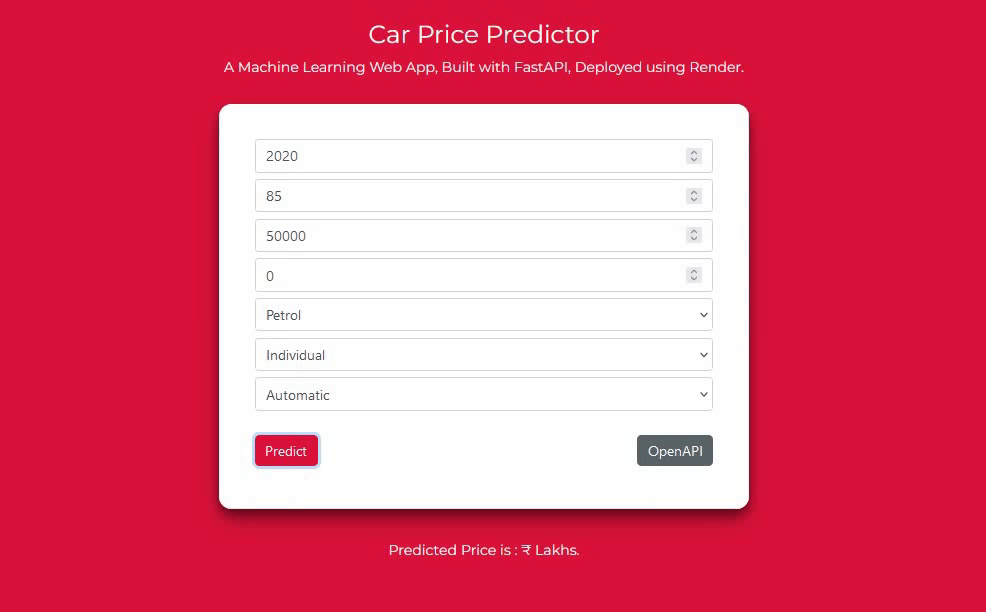

# Pricefy


Pricefy app used to predict the price of the car based on certain input parameters created using python's scikit-learn, fastapi, numpy and joblib packages.

## Dataset Description

This dataset contains information about used cars. This data can be used for a lot of purposes such as price prediction to exemplify the use of linear regression in Machine Learning.

The data contains the following columns:

| Feature Name  | Feature Description                      |
| ------------- | ---------------------------------------- |
| Name          | Name of the Car model                    |
| Present_Price | Present showroom price of the car        |
| Year          | Car Model Year                           |
| Kms_Driven    | Kilometers driven till now               |
| Owner         | No of Owners (0 or 1 or 2 or 3)          |
| Fuel_Type     | Type of Fuel (Petrol or Diesel or CNG)   |
| Seller_Type   | Whether seller is (Individual or Dealer) |
| Transmission  | Transmission type (Automatic or Manual)  |
| Selling_Price | Used Car selling price (Target) variable |

## Installation
Open Anaconda prompt and create new environment
```
conda create -n your_env_name python = (any_version_number)
```
Then Activate the newly created environment
```
conda activate your_env_name
```
Clone the repository using `git`
```
git clone https://github.com/Prakashdeveloper03/Pricefy.git
```
Change to the cloned directory
```
cd <directory_name>
```
To install all requirement packages for the app
```
pip install -r requirements.txt
```
Then, Run the app
```
uvicorn main:app --reload
```

## 📷 Screenshots
### Home page

### About section

### Developer section

### Swagger UI

### Redoc UI

### Demo GIF

